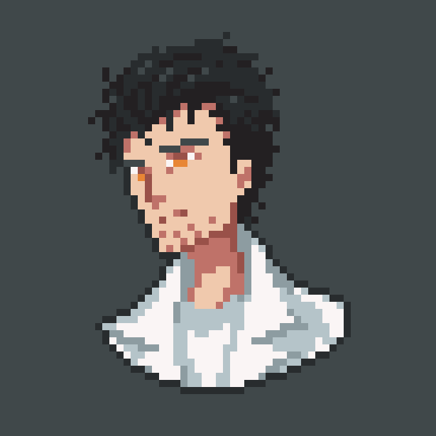
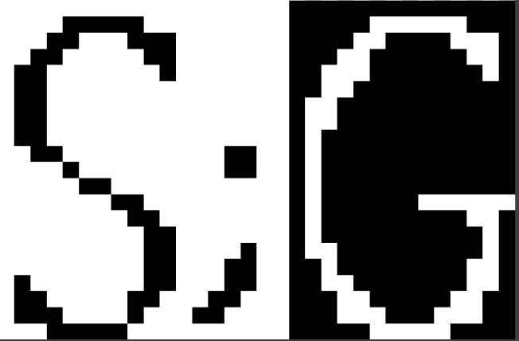
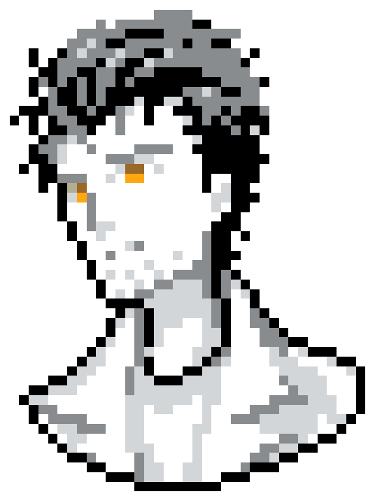
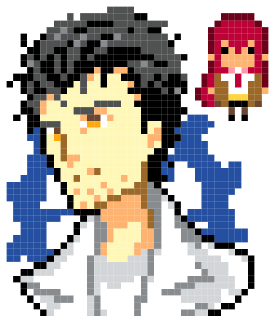
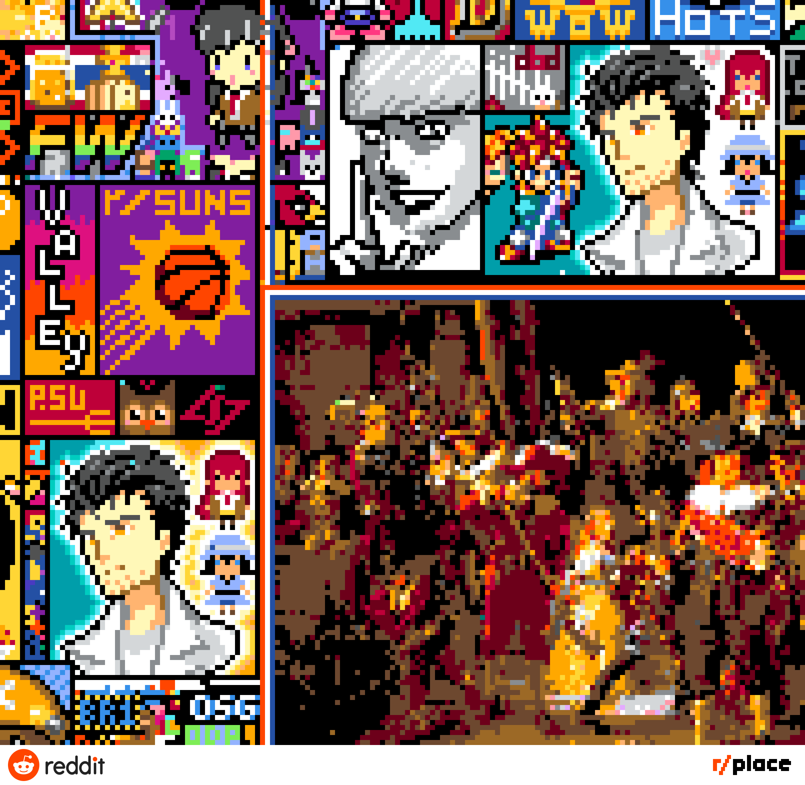
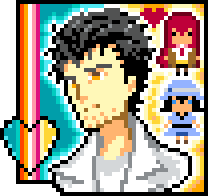

### History of Operation Elysian.
*(2nd draft by M_Breviger.)*

The Steins;Gate r/place effort started late April 1st with a post by reddit user Garlic-Bread56 in the r/steinsgate subreddit with art from @FrenDiaga on twitter, as seen below. Seeking interest in potentially getting Steins;Gate on r/place.[^(1)]  [^(2)]

On April 2nd the discord server founded by Garlic-Bread56 for the purpose for project coordinaton eventually decided upon and released a design for placing. The Steins;Gate initials.

With the first map expansion of r/place we made our move, attempting to build the initials of Steins;Gate in the new area. We eventually managed to almost complete the design. Until we were wiped by another group which built atop us.

With this we realised the unfeasibility of such a large art with such fierce competition. We then worked on a smaller art, a divergence meter. Which we started building in a quiet spot atop the Netherlands flag.

We were almost doomed to manual placing with reference photos but. We were contacted by some programmers who helped us out by making an overlay. This drastically improved the effectiveness and ease of the placing.

We eventually succeeded with the Divergence Meter artwork and relaxed for a while. Shortly after completing the art we were contacted by the people building the Super Mario 64 logo below us, asking us to move up a pixel so they could have some space. We complied and moved up a pixel. We also tweaked the Divergence Meter giving it a different look.

In the early hours of April 3rd EST we contacted PlaceNL on whom we built our art atop seeking protection from the expansion of their orange line. A proposal to leave our art alone in exchange for 40-50 bots was proposed. We then put the proposal to a referendum. It did not pass, our members did not want to run bots. However PlaceNL put to a vote whether to keep our art or remove it. They voted to keep our art for the moment.

In worry of our art being erased by PlaceNL if they changed their minds we began looking for places to move to. During this we contacted the TitanFolk the makers of the Eren head in the top left corner. We asked them if we could build a chibi Kurisu near them, this did not pan out but we made an agreement with them for mutual protection on the next map expansion.

With the map expansion on April 3rd we began our next artwork the original art proposed by Garlic-Bread56.

We then set to work building Okabe. As the art was being built around us a streamer known as XQC, wiped out our art. We then rebuilt Okabe with the new color palette giving him a skintone and hair color.

After completing our art we make contact and ally with our neighbors Chronotrigger, Dead by Daylight, World of Warcraft, and Heroes of the Storm we also helped out our ally TitanFolk as they built their artwork of Floch Forster. We also continued updating our Okabe artwork adding a blue gear in the background and a chibi Kurisu.

In the midst of adding the blue gear to Okabe we were contacted by PlaceNL informing us they were going to move our Divergence Meter to a new location. (ehh not sure when this happened)

On April 4th we were contacted again by PlaceNL informing us they were going to build a massive painting over our location. We then made a deal with PlaceNL to have us along with our allies moved to new locations. This went very well and for a brief moment two Okabes existed on the map.

In our new location we were contacted by a group who wanted to build a lesbian flag in a no mans land between us and the Boston Bruins logo we allowed it and helped them in building the flag.

We also helped out our ally Chronotrigger in getting established however. A new streamer arrives Quin69. Quin69 claims some area above the Boston Celts and procedes building an artwork representing him he then builds a penis though Chronotriggers artwork and destroyed Dead by Daylights artwork.

We manage to drive Quin69 back after allying with the Boston Bruins. We also after much consideration we properly ally with PlaceNL with us joining their bot protection in exchange for us running their bot. It was at this time we finalised the Okabe artwork.

The Whiteout. As the whiteout began we halted all pixel placement and watched as the whiteout unfolded.

-------------------------------------------------------

### Notes

Okay 2nd draft with markdown and better writing.
This is not final for the wiki submission. I'll be using this as help for when I write the wiki entry.
Please give me feedback on the discord.

[^(1)]: https://www.reddit.com/r/steinsgate/comments/ttzwrn/we_should_make_something_steinsgate_related_on/
[^(2)]: https://twitter.com/FrenDiaga/status/1182756048593137664
